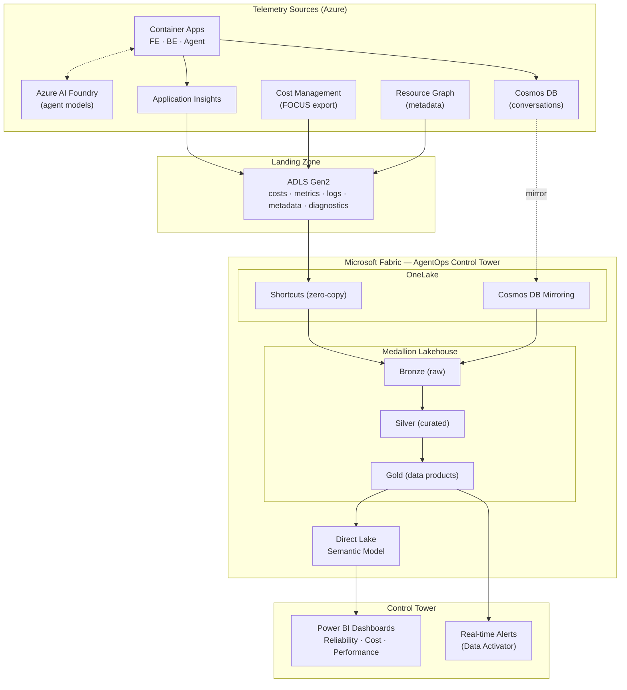

# Frontier Fabric AgentOps RVAS

### Build an **AgentOps Control Tower** on Microsoft Fabric

> A hands-on, challenge-based RVAS (Real Value Acceleration Solutions) where your team builds a Fabric-based control tower that
> **ingests and correlates telemetry from Azure services and Foundry-built agents** — enabling
> end-to-end monitoring, analytics, and dashboards for **reliability, cost, and performance**.


---

## The Mission

Your customer has gone all-in on AI agents. Teams across the business are shipping agents built on
**Azure AI Foundry**, running on **Azure Container Apps**, and backed by **Cosmos DB**. Adoption is
exploding — and so is the blind spot.

Nobody can answer the questions leadership keeps asking:

- **Reliability** — Which agents are healthy? Where are errors and latency spikes coming from?
- **Cost** — What is each agent costing us? Which team or use case owns that spend?
- **Performance** — Are we meeting SLAs? How many tokens are we burning, and is it trending up?

The telemetry exists, but it is scattered across Application Insights, Azure Monitor, Cost
Management, Resource Graph, and Cosmos DB. The customer has chosen **Microsoft Fabric** to unify it
all into a single **AgentOps Control Tower**.

**That is your job.** Over the course of this RVAS your team will stand up the end-to-end
platform: light up a live agent workload, land its telemetry in a lake, connect it to Fabric with
zero-copy OneLake shortcuts and Cosmos DB Mirroring, refine it through a medallion architecture, and
deliver the Control Tower dashboards that finally give the business a single pane of glass.

This is **not** a guided click-through. Each challenge gives you a goal and success criteria — *how*
you get there is up to your team. Coaches are in the room to unblock you, not to hand you the answer.

---

## What You'll Build



By the end you will have a working pipeline that flows from **a user's click**, through **agent
inference and tool calls**, into **OneLake**, and out to **executive dashboards and live alerts** —
all on first-party Microsoft technology.

---

## RVAS Format

| | |
|---|---|
| **Style** | Team-based (3–5 people), coach-facilitated, challenge-driven |
| **Level** | 200–400 (intermediate to advanced) |
| **Duration** | 1.5–2 days (7 challenges, ~1.5–2.5 hrs each; Challenge 6 is a stretch) |
| **Environment** | The **customer's own** Azure subscription(s) + a Microsoft Fabric capacity (**trial capacity is fine**) |
| **Roles** | Platform/Cloud engineer · Data engineer · FinOps practitioner · AI engineer (mix per team) |

Teams progress through the challenges in order — each one builds on the last. You are encouraged to
divide and conquer within a challenge, then regroup at each success checkpoint.

---

## The Challenges

| # | Challenge | What you'll achieve | Primary skills |
|---|---|---|---|
| **0** | [Mission Briefing & Environment Setup](challenges/challenge-00-mission-setup.md) | Azure + Fabric trial capacity ready, tooling installed, team onboarded | Setup, Fabric admin |
| **1** | [Light Up the Agents](challenges/challenge-01-agent-telemetry.md) | Deploy the Foundry agent workload and confirm telemetry is flowing | Azure, Container Apps, App Insights |
| **2** | [Build the Telemetry Landing Zone](challenges/challenge-02-landing-zone.md) | Land cost, metrics, logs, metadata & diagnostics in ADLS Gen2 | Azure Monitor, FinOps, IaC |
| **3** | [Connect Fabric to the Enterprise](challenges/challenge-03-onelake-foundation.md) | Lakehouse + OneLake shortcuts + Cosmos DB Mirroring (zero-copy) | Fabric, OneLake |
| **4** | [Refine the Signal](challenges/challenge-04-medallion-pipeline.md) | Bronze→Silver→Gold medallion pipeline correlating all sources | PySpark, data engineering |
| **5** | [Stand Up the Control Tower](challenges/challenge-05-control-tower-dashboards.md) | Direct Lake semantic model + Reliability/Cost/Performance dashboards | Power BI, DAX, semantic modeling |
| **6** | [Make It Operational](challenges/challenge-06-operationalize.md) 🏆 | Stretch: real-time alerts, FinOps chargeback, RLS, automation | Data Activator, FinOps, governance |

See the [**Challenge Index**](challenges/README.md) for the full arc, dependencies, and scoring.

---

## Getting Started

1. **Read the mission** (above) and the [reference architecture](docs/architecture.md).
2. **Confirm prerequisites** — work through [`docs/prerequisites.md`](docs/prerequisites.md) with your coach **before day 1**. This covers Azure roles, Fabric trial capacity, and local tooling.
3. **Start with [Challenge 0](challenges/challenge-00-mission-setup.md).**
4. Keep the [FAQ](docs/faq.md) handy.

> 💡 **Coaches:** start at the [Coach Handbook](coach/README.md). Each challenge has a matching coach
> guide with the reference solution, key commands, common pitfalls, and talking points.

---

## Repository Structure

```
frontier-fabric-agentops-rvas/
├── README.md                     ← you are here
├── docs/
│   ├── architecture.md           # Reference architecture & data flows
│   ├── prerequisites.md          # Azure + Fabric trial capacity + tooling setup
│   └── faq.md                    # Frequently asked questions
├── challenges/                   # 👩‍💻 Attendee-facing challenge guides (WHAT to build)
│   ├── README.md                 # Challenge index, dependencies, scoring
│   └── challenge-00 … 06.md
├── coach/                        # 🧑‍🏫 Instructor-facing guides (HOW it's done)
│   ├── README.md                 # Coach handbook: logistics, timing, facilitation
│   └── challenge-00 … 06-guide.md
└── resources/                    # 🧰 Provided reference assets (IaC, code, notebooks)
    ├── README.md
    ├── agent-workload/           # Foundry agent runtime (Container Apps, APIM, Cosmos DB)
    ├── observability-ingestion/  # ADLS Gen2 landing zone + export scripts
    ├── fabric-control-tower/     # Fabric workspace setup, medallion notebooks, pipelines, model
    └── observability-sdk/        # Shared Python SDK for agent telemetry
```

The `resources/` directory contains a **complete reference implementation**. Teams are encouraged to
deploy the provided infrastructure as a foundation and focus their creative energy on the Fabric
Control Tower itself. Coaches hold the keys to the reference solution for each challenge.

---

## Outcomes

After this RVAS, your team will be able to:

- Deploy and instrument **Azure AI Foundry agents** that emit production-grade telemetry.
- Build a unified **observability landing zone** spanning telemetry, cost, and metadata.
- Use **OneLake shortcuts** and **Cosmos DB Mirroring** to bring enterprise data into Fabric with zero copy.
- Engineer a **medallion (Bronze/Silver/Gold)** lakehouse that correlates reliability, cost, and performance signals.
- Deliver **Direct Lake** Power BI dashboards and **real-time alerts** for an AgentOps Control Tower.
- Apply **FinOps** practices (FOCUS cost normalization, chargeback/showback) to AI workloads.

---

## Contributing

This RVAS is maintained as an open asset. See [`CONTRIBUTING.md`](CONTRIBUTING.md) for how to
propose improvements, report issues, or add challenges. Bug reports and feature requests are welcome
via GitHub Issues.

## License

Licensed under the [MIT License](LICENSE).
