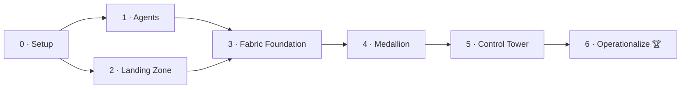

# Challenges — AgentOps Control Tower

Welcome to the build. These seven challenges take you from an empty subscription to a fully
operational **AgentOps Control Tower** on Microsoft Fabric.

## How the challenges work

- **Goal-oriented, not click-by-click.** Each challenge gives you a scenario, clear **objectives**,
  and **success criteria**. *How* you get there is your team's call. The
  [`resources/`](../resources/) folder is your toolbox.
- **Sequential.** Each challenge builds on the previous one — complete them in order.
- **Checkpoints.** When you meet the success criteria, show your coach for a ✅ before moving on.
- **Hints are there if you need them.** Each challenge ends with hints and links. Try first, then
  peek. Coaches hold the full reference solution.

## The arc

| # | Challenge | Depends on | Est. | Theme |
|---|---|---|---|---|
| **0** | [Mission Briefing & Environment Setup](challenge-00-mission-setup.md) | — | 1–1.5 h | Access, tooling, Fabric capacity |
| **1** | [Light Up the Agents](challenge-01-agent-telemetry.md) | 0 | 1.5–2 h | Deploy a Foundry agent workload that emits telemetry |
| **2** | [Build the Telemetry Landing Zone](challenge-02-landing-zone.md) | 0 | 1.5–2 h | Land cost, metrics, logs & metadata in ADLS Gen2 |
| **3** | [Connect Fabric to the Enterprise](challenge-03-onelake-foundation.md) | 1, 2 | 2 h | Lakehouse, OneLake shortcuts, Cosmos DB Mirroring |
| **4** | [Refine the Signal](challenge-04-medallion-pipeline.md) | 3 | 2–2.5 h | Bronze → Silver → Gold medallion + pipeline |
| **5** | [Stand Up the Control Tower](challenge-05-control-tower-dashboards.md) | 4 | 2–2.5 h | Direct Lake model + Power BI dashboards |
| **6** | [Make It Operational](challenge-06-operationalize.md) 🏆 | 5 | 1.5–2 h | Stretch: alerts, chargeback, RLS, automation |

> 💡 Short on time? Challenges 1 and 2 are independent of each other and can be tackled **in
> parallel** by splitting your team. They must both finish before Challenge 3.

## Scoring

This is a learning RVAS, not a competition — but if your event wants friendly scoring, here's a
simple rubric (coaches can adapt). Points are awarded per challenge at the success checkpoint.

| Challenge | Base points | Bonus opportunities |
|---|---|---|
| 0 | 5 | Everyone on the team can `az login` + reach Fabric (+5) |
| 1 | 15 | Custom token/cost metric visible in App Insights (+5); end-to-end trace shown (+5) |
| 2 | 15 | All 5 data domains landing (+5); FOCUS cost file validated (+5) |
| 3 | 20 | Mirroring latency < 1 min demonstrated (+5); zero-copy explained to coach (+5) |
| 4 | 25 | Gold correlates cost **and** agent telemetry (+10); pipeline runs green end-to-end (+5) |
| 5 | 20 | All three dashboard themes built (+5); Direct Lake confirmed (+5) |
| 6 🏆 | 20 | Live alert fires (+5); chargeback by team/use case (+5); RLS (+5) |

**Judging themes** (for a showcase at the end): *Does the Control Tower answer the three business
questions — reliability, cost, performance? Is the data correlated, not just collected? Could the
customer actually run on this?*

## What "done" looks like

By the end of Challenge 5 your team can stand in front of the customer's leadership and answer, live:

1. **Which agents are healthy right now, and where are the errors?** (Reliability)
2. **What is each agent / team / use case costing us?** (Cost)
3. **Are we meeting our SLAs, and how much are we scaling?** (Performance)

Challenge 6 makes it *operational* — the Control Tower starts telling **you** when something's wrong.

---

Ready? Start with **[Challenge 0 — Mission Briefing & Environment Setup](challenge-00-mission-setup.md)**.
