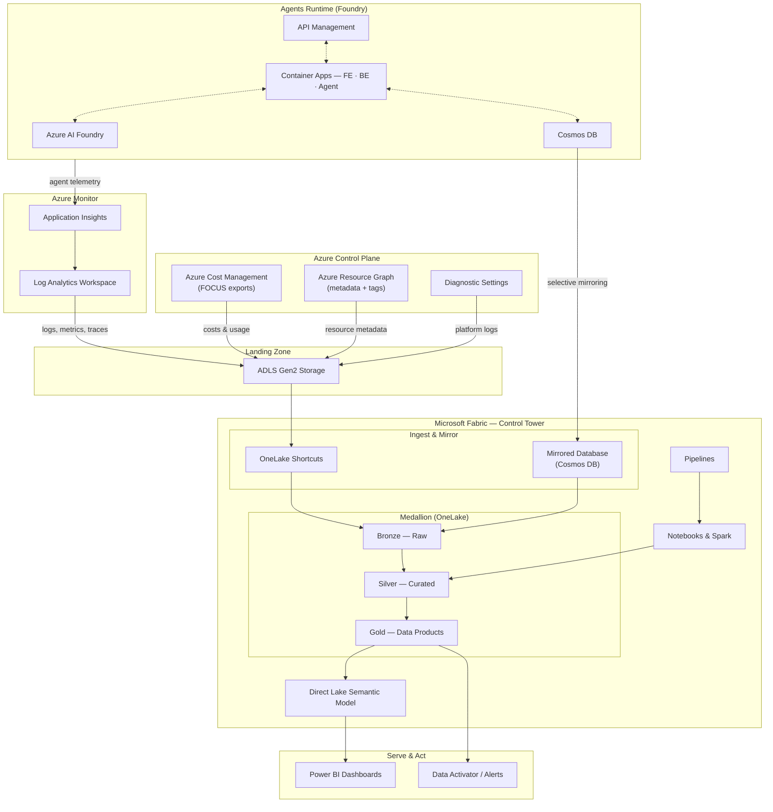

# Reference Architecture — AgentOps Control Tower (Fabric Edition)

This document describes the end-to-end architecture your team will build during the hackathon. Use
it as your north star: every challenge stands up one slice of this picture.

> The `resources/` directory contains a working reference implementation of everything described
> here. Treat it as the "answer key" foundation — deploy what accelerates you, and spend your
> creativity on the Fabric Control Tower.

---

## The big picture



---

## The four stages

The platform moves data through four stages. Each maps directly to one or more challenges.

### 1. Emit — *Challenge 1*

Foundry-built agents running on Azure Container Apps emit structured telemetry through Application
Insights and OpenTelemetry. Every hop — frontend → API Management → backend → agent → model — is a
trace span. The agent service records **custom metrics** for token usage and latency, and persists
every conversation to Cosmos DB. The shared [`observability-sdk`](../resources/observability-sdk)
enforces a consistent event schema across agents.

### 2. Ingest — *Challenge 2*

The control plane and Azure Monitor feed a single landing zone:

| Source | Container | Format | Cadence |
|---|---|---|---|
| Azure Cost Management | `costs` | FOCUS Parquet (Snappy) | Daily |
| Azure Resource Graph | `metadata` | Parquet | Daily |
| Log Analytics data export | `metrics`, `logs` | JSON | Continuous |
| Diagnostic settings | `diagnostics` | JSON | Continuous |

All land in **ADLS Gen2** with hierarchical namespace and date-partitioned paths for efficient Spark
reads.

### 3. Process — *Challenges 3 & 4*

Microsoft Fabric brings the data in **without copying it**:

- **OneLake shortcuts** point at the ADLS Gen2 containers — Fabric reads them as if local.
- **Cosmos DB Mirroring** continuously replicates agent conversations into OneLake Delta tables.

A **medallion architecture** then refines the data:

- **Bronze** — raw ingest, full fidelity, lineage columns (`_source_file`, `_ingestion_timestamp`).
- **Silver** — cleansed and standardized; costs normalized to the [FOCUS](https://focus.finops.org/) spec, metrics pivoted to a 5-minute grain, logs parsed, metadata flattened.
- **Gold** — analytics-ready data products that **correlate** cost, telemetry, and agent activity.

Pipelines orchestrate Bronze → Silver → Gold → semantic-model refresh with dependency ordering,
retries, and failure alerts.

### 4. Serve & Act — *Challenges 5 & 6*

A **Direct Lake** semantic model reads the Gold Delta tables directly from OneLake — import-like
performance, no data movement, always current after a pipeline run. **Power BI** dashboards surface
the Control Tower views, and **Data Activator** raises real-time alerts when KPIs breach thresholds.

---

## Components

| Component | Directory | Description | Key technologies |
|---|---|---|---|
| Agent Workload | `resources/agent-workload/` | Full-stack Foundry agent app — frontend, backend API, agent orchestration | Container Apps, API Management, Cosmos DB, Azure AI Foundry, Application Insights |
| Observability Ingestion | `resources/observability-ingestion/` | Landing zone collecting telemetry, cost, and metadata into a data lake | ADLS Gen2, Cost Management, Resource Graph, Log Analytics export, Diagnostic Settings |
| Fabric Control Tower | `resources/fabric-control-tower/` | Workspace setup, medallion notebooks, pipelines, and semantic model | Fabric Lakehouse, PySpark (Bronze/Silver/Gold), Cosmos DB Mirroring, Pipelines, Power BI |
| Observability SDK | `resources/observability-sdk/` | Shared Python library for consistent agent telemetry | Python, OpenTelemetry, Application Insights SDK |

---

## The Gold data products

The Gold layer is the heart of the Control Tower. It produces the data products that answer the
business questions:

| Gold table | Answers | Powers |
|---|---|---|
| `gold_cost_summary` | What did each service / resource group / tag cost, by day and month? | Cost dashboard, FinOps chargeback |
| `gold_operational_metrics` | What are the error rates and latency percentiles (p50/p95/p99) per service? | Reliability dashboard, alerts |
| `gold_agent_analytics` | How many conversations, tokens, and what response time & satisfaction per agent? | Performance dashboard |
| `gold_capacity_usage` | How utilized is each resource (CPU/memory/throughput) over time? | Capacity planning |
| `gold_resource_inventory` | What resources exist, and how have they changed (SCD Type 2)? | Inventory, governance |
| `dim_date`, `dim_resource` | Conformed dimensions for time intelligence and drill-down | Every report |

### Agent namespace pattern

Agents are identified by a hierarchical namespace so dashboards can aggregate at any level:

```
<organization>.<domain>.<agent-name>.<version>
```

Example: `contoso.finance.invoice-processor.v2`. Combined with **resource tags**, this is what makes
**chargeback and showback by team, use case, and client** possible (Challenge 6).

---

## Core KPIs

The Control Tower is graded on whether it can surface these:

- **Reliability** — error rate by agent/error type; P50/P95/P99 latency; availability; pipeline health.
- **Cost** — blended cost per request (model tokens + Cosmos RUs + compute + APIM); cost per agent; MoM trend; run rate by team/use case.
- **Performance** — throughput (req/min/hr); prompt & completion token consumption; satisfaction; capacity utilization.

---

## Why Microsoft Fabric

Fabric unifies data engineering, warehousing, real-time intelligence, and BI on a single **OneLake**
foundation. For an AgentOps Control Tower that is decisive:

- **OneLake shortcuts** eliminate data duplication and egress for ADLS Gen2 telemetry.
- **Mirroring** gives near-real-time Cosmos DB replication with no ETL to manage.
- **Direct Lake** delivers import-grade Power BI performance straight off Delta — no refresh lag.
- **Data Activator** turns Gold-layer conditions into live operational alerts.

Synapse and Databricks are valid alternatives for the medallion layer; the tight Lakehouse → model →
Power BI → Data Activator integration is what makes Fabric the natural fit here.
